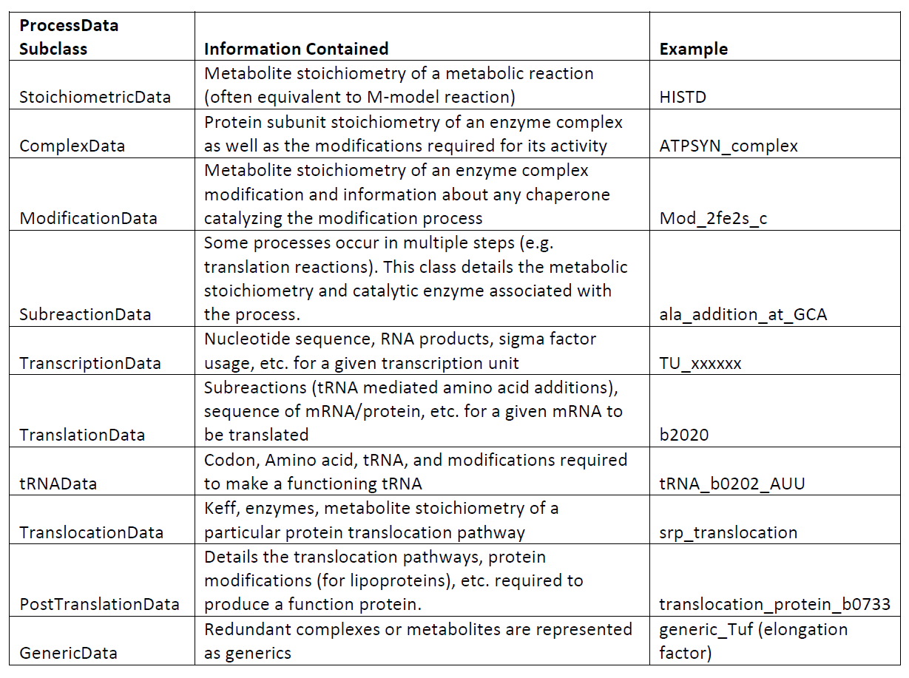
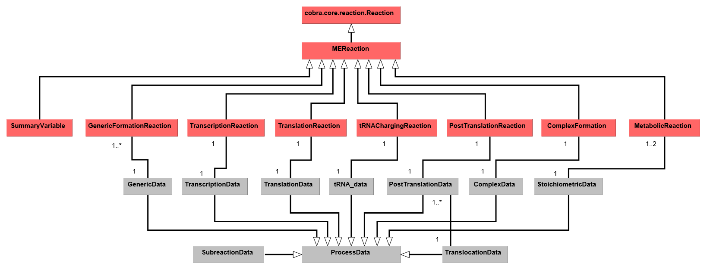

COBRAme Software Architecture
=============================

The COBRAme codebase is constructed with the intention of including all of the
metabolic processes and complexity associated with gene expression, while still
giving a final ME-model that is not prohibitively difficult to use and interpret.
To accomplish this COBRAme separates the information associated with
each cellular process from the actual ME-model reaction in which the process is
modeled. We call these two major python classes ProcessData and
MEReaction, respectively. The logic behind each of these classes is briefly presented
below, and a description of the class attributes and properties is presented
here in the form of a :download:`UML Diagram <_static/cobrame_full_uml.pdf>`.

ProcessData
~~~~~~~~~~~

The previous ME-models for *E. coli* and *T. Maritima* were reconstructed by
first establishing a database containing information about all gene expression
processes known in the organism being model. This included, for instance,
enzyme complex subunit stoichiometries or the *E. coli* transcription unit
architecture. Then, when building the ME-model, the database
was queried to obtain any relevant information and incorporate this into the
appropriate reactions. For the COBRAme formulation, this database was replaced
by the ProcessData "information storage" class. The ProcessData class generally
consists of attributes which use simple python types (string, dictionary, etc.)
to describe features of a biological process.

The use of the ProcessData class has the advantage of:

1. Simplifying the process of querying information associated with a cellular function
2. Allowing edits to this information which can easily be applied throughout the model without rebuilding from scratch
3. Enabling additional computations to be performed and seamlessly accessed as ProcessData class methods

The ProcessData classes are broken into the following subclasses:

MEReaction
~~~~~~~~~~

COBRAme compartmentalizes the major reaction types into their own MEReaction
classes. Each of these classes contains a single *update* function
which effectively reads in the appropriate ProcessData types, applies the
coupling constraints on the macromolecules, and assembles these components into a
complete model reaction. This allows changes made to the ProcessData describing a
particular cellular process to easily be incorporated into the reactions which it was used.

Overview
~~~~~~~~

Using the major classes described above, reconstructing a ME-model can then be broken
down into three steps:

1. Define and construct all necessary ProcessData objects
2. Link the ProcessData to the appropriate MEReaction instance
3. Update all MEReactions to incorporate ProcessData information into functional reactions

The overall codebase architecture is displayed below in a UML diagram.
This reduced UML highlights the ways which MEReactions and ProcessData are linked
in a ME-model reconstructed using COBRAme. A full UML representation of the
COBRAme/ME-model software architecture can be
downloaded :download:`here <_static/cobrame_full_uml.pdf>`

