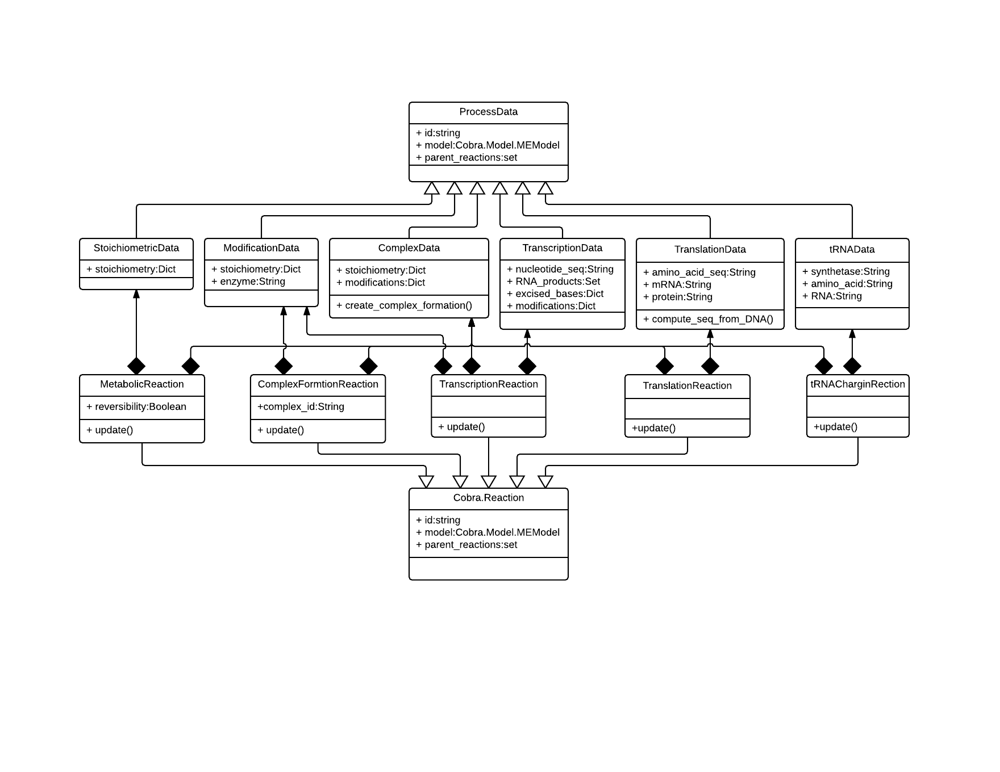

ME-Model Architecture
=====================

The COBRAme codebase is constructed with the intention of both
including all of the metabolic processes associated with gene expression, while also
giving a final ME-model that was not prohibitively difficult to use and interpret.
To accomplish this we decided to separate the information associated with
each cellular process from the actual ME-model reaction in which the process is
modeled. We called these two major object classes ProcessData and
MEReaction, respectively. The logic behind each of these classes is briefly presented
below, and a description of the class attributes and properties is presented in
xxxx.

ProcessData
~~~~~~~~~~~

The previous ME-models for *E. coli* and *T. Maritima* established a database
containing, for instance, all of the enzyme complex stoichiometries or the *E. coli*
transcription unit architecture. Then, when building the ME-model, the database
was queried to obtain any relevant information and incorporate this into the
appropriate reactions. For the COBRAme formulation, this database was replaced
by the ProcessData "information storage" class. The ProcessData class generally
consists of attributes which use simple python types (string, dictionary, etc.)
to describe features of a biological process.

The use of the ProcessData class has the advantage of:

1. Simplifying the process of querying information associated with a cellular function
2. Allowing edits to this information to easily be applied throughout the model without rebuilding from scratch
3. Enabling additional computations to be performed and seamlessly accessed as ProcessData class properties

The ProcessData classes are broken into the following subclasses:

.. image:: _static/process_data_definitions.png

MEReaction
~~~~~~~~~~

COBRAme compartmentalizes the major reaction types into their own MEReaction
classes. Each of these classes contains a single *update* function
which effectively reads in the appropriate ProcessData types, applies the
coupling constraints on the macromolecules and assembles these into a
complete model reaction. This allows changes made to the ProcessData of a
cellular process to easily be incorporated into the reactions which it was used.

Overview
~~~~~~~~

Using the major classes described above, building a ME-model can then be broken
down into two steps:

1. Define and construct all necessary ProcessData objects
2. Link the ProcessData to the appropriate MEReaction

The overall codebase architecture is displayed below in the following UML diagram.
This includes the ways which MEReactions and ProcessData are often linked
in the model.

